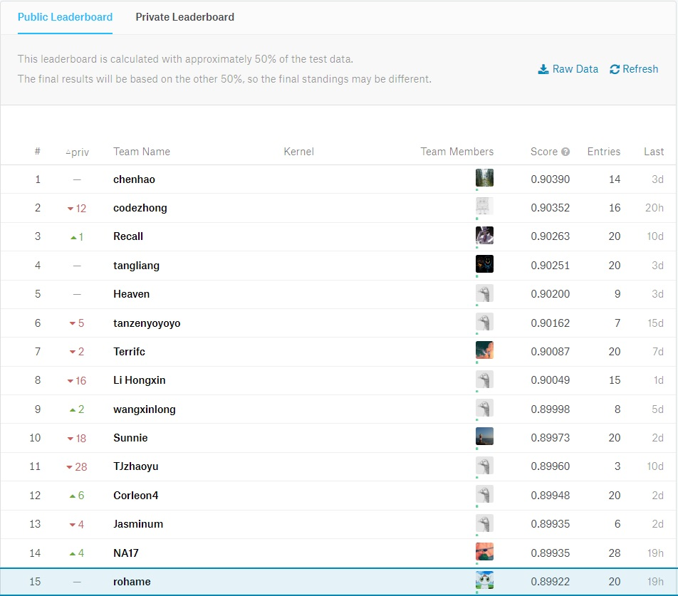
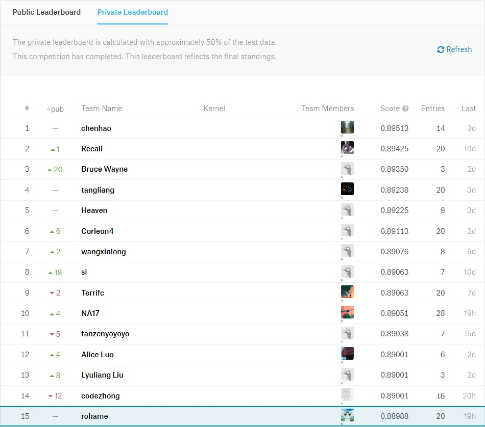
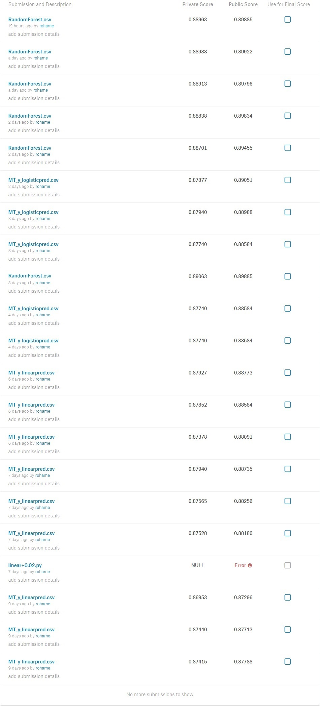

#银行客户定期存款意向二分类预测
>1452458 叶承玮
+ 任务：利用提供的银行客户信息对客户是否会定期存款进行二分类预测。
+ 历时：约一个月
+ 使用语言：Python
+ 详细说明：https://www.kaggle.com/c/tonhjiprmidterm
+ 尝试使用分类器：sklearn中的LogisticRegression()、LinearRegression()、RandomForestClassifier()
</br>
以下是本次任务的过程：

## 数据导入及预处理
需要包含的库：

    import pandas as pd
    from sklearn.preprocessing import LabelEncoder

读取MT_Train.csv和MT_Test.csv
    
    train_data = pd.read_csv('MT_Train.csv')
    pred_data = pd.read_csv('MT_Test.csv')

提取每一列数据并打上标记

    # do preprocessing
    strIndex = train_data.columns[train_data.dtypes == object]
    for i in strIndex:
        le = LabelEncoder()
        le.fit(train_data[i])
        train_data[i] = le.transform(train_data[i])
        try:
            pred_data[i] = le.transform(pred_data[i])
        except:
            pass

选取输入的属性X和输出的值y

    X = train_data.iloc[:, :-1]
    y = train_data.iloc[:, -1]
    X_train, X_test, y_train, y_test = train_test_split(X, y)

    # prepare test data
    X_pred = pred_data.iloc[:, 1:]

##对不同分类器的尝试
###1.用LinearRegression()预测
需要包含的库：

    from sklearn.linear_model import LinearRegression

定义LinearRegression的缩写

    mx = LinearRegression()
    mx.fit(x_train.values, y_train.values)

用.predict方法进行预测（得到0或1的值）

    y_pred = {}
    y_predY=[]
    y_predS=[]
    y_predNum = mx.predict(X_pred)
    y_predNum = y_predNum.round().astype(int)

把0记为no，1记为yes，存入列表，转换为DataFrame，并输出
    
    for i in y_predNum:
        if i==0:
            y_predY.append('no')
        else:
            y_predY.append('yes')
    leng = len(y_predNum)
    for i in range(0,leng):
        y_predS.append(i)
    y_pred['sampleId'] = y_predS
    y_pred['y'] = y_predY
    data = pd.DataFrame(y_pred)
    data.to_csv('MT_y_linearpred.csv', index=False)

###2.用LogisticRegression()预测
需要包含的库：

    from sklearn.linear_model import LogisticRegression
    
定义LogisticRegression的缩写

    mx = LogisticRegression()
    mx.fit(x_train.values, y_train.values)
用.predict方法进行预测（得到0或1的值）

    y_pred = {}
    y_predY=[]
    y_predS=[]
    y_predNum = mx.predict(X_pred)
    y_predNum = y_predNum.round().astype(int)
把0记为no，1记为yes，存入列表，转换为DataFrame，并输出
    
    for i in y_predNum:
        if i==0:
            y_predY.append('no')
        else:
            y_predY.append('yes')
    leng = len(y_predNum)
    for i in range(0,leng):
        y_predS.append(i)
    y_pred['sampleId'] = y_predS
    y_pred['y'] = y_predY
    data = pd.DataFrame(y_pred)
    data.to_csv('MT_y_logisticpred.csv', index=False)

###3.用RandomForestClassifier()预测
&emsp;&emsp;随机森林(Random Forest)在以决策树为基学习器构建Bagging集成的基础上，进一步在决策树的训练过程中引入了随机属性选择。随机森林简单、容易实现、计算开销小，在很多现实任务中展现出强大的性能。随机森林中基学习器的多样性不仅来自样本扰动，还来自属性扰动，这就使最终集成的泛化性能可通过个体学习器之间差异度的增加而进一步提升。随机森林的起始性能往往相对较差，但随着个体学习器数目的增加，通常会收敛到更低的泛化误差。
需要包含的库：

    from sklearn.ensemble import RandomForestClassifier

定义RandomForestClassifier的缩写

    clf = RandomForestClassifier(n_estimators=12000, n_jobs=-1, class_weight={0:5})
    clf.fit(X, y)
用.predict方法进行预测（得到0或1的值）

    y_pred = {}
    y_predY=[]
    y_predS=[]
    y_predNum = clf.predict(X_pred)
    y_predNum = y_predNum.round().astype(int)
把0记为no，1记为yes，存入列表，转换为DataFrame，并输出
    
    for i in y_predNum:
        if i==0:
            y_predY.append('no')
        else:
            y_predY.append('yes')
    leng = len(y_predNum)
    for i in range(0,leng):
        y_predS.append(i)
    y_pred['sampleId'] = y_predS
    y_pred['y'] = y_predY
    data = pd.DataFrame(y_pred)
    data.to_csv('RandomForest.csv', index=False)

##第一次尝试之后的思考
&emsp;&emsp;尝试提交三种方法得出的预测结果之后，RandomForest的F1 Score是最好的，LogisticRegression次之，LinearRegression最低，大致都在0.88左右，需要改进。
&emsp;&emsp;在之前的算法中，我是直接把.predict方法输出的预测概率作四舍五入，然后把0设定成no，1设定成yes。一般来说，不同的分类器预测某一个样本的概率不应该有太大出入，可能会在很小的范围内波动。当这个概率在远离0.5的地方波动，由于都要作四舍五入的处理，各分类器的最终结果不会有区别。但是，当这个概率在0.5附近波动时，可能有的分类器预测概率是0.49，另一些分类器预测概率是0.51，在作四舍五入的时候就会出现偏差。因此，我想采用修改阈值的方法使算法的预测更加准确。
###1、对LinearRegression()的修正
&emsp;&emsp;使用.predict_proba方法，产生预测为yes的概率值（此处.predict_proba和.predict都是产生实际概率值。为了和另两种方法的代码保持一致，使用前者），然后在所有概率值上加一个数（相当于阈值降低这个数值）。经过多次试验，+0.1125是能使LinearRegression取得最大F1 Score的参数，在public子集中能取得0.88773的分数。
```
y_pred = {}
y_predY=[]
y_predS=[]
y_predNum = mx.predict_proba(X_pred)
probability = []
length = len(y_predNum)
for i in range(0,length):
    y = y_predNum[i]
    prob = y[-1]+0.1125
    prob = prob.round().astype(int)
    probability.append(prob)

for i in probability:
if i==0:
    y_predY.append('no')
else:
    y_predY.append('yes')
```
###2、对LogisticRegression()的修正
&emsp;&emsp;LogisticRegression.predict产生值本身就是近似过后的0和1，为了使用原始概率，采用.predict_proba方法。原理同上。经多次试验，+0.15是能使LogisticRegression取得最大F1 Score的参数，在public子集中能取得0.89051的分数。以上两种方法的修正之后在private子集中的最好成绩在0.87940左右。
```
mx = LogisticRegression()
mx.fit(x_train.values, y_train.values)
y_pred = {}
y_predY=[]
y_predS=[]
y_predNum = mx.predict_proba(X_pred)
probability = []
length = len(y_predNum)
for i in range(0,length):
    y = y_predNum[i]
    prob = y[-1]+0.15
    prob = prob.round().astype(int)
    probability.append(prob)

for i in probability:
if i==0:
    y_predY.append('no')
else:
    y_predY.append('yes')
```
###3、对RandomForestClassifier()的修正
&emsp;&emsp;RandomForestClassifier()产生的结果本身带有随机性，同样的算法每次运行的结果有细微的偏差，我试图通过调整阈值的方法使预测结果达到最优。原理同上。修正后在public子集中最高能达到0.89922,在private子集中最高能达到0.89063的分数（两次最高分不是同一个算法）。
```
clf = RandomForestClassifier(n_estimators=12000, n_jobs=-1, class_weight={0:5})
clf.fit(X, y)
y_pred = clf.predict_proba(X_pred)
probability = []
length = len(y_pred)
for i in range(0,length):
    y = y_pred[i]
    prob = y[-1]+0.025
    prob = prob.round().astype(int)
    probability.append(prob)
```
##任务结果
Public Leader Board:

</br>
Private Leader Board:

</br>
My Submissions:
